# anaLOG: The friendly log and model analyzer #
This project accompanies the paper *Important Factors: Complexity Dimensions for Petri Nets*.
With this tool, you can reproduce the results of the paper or perform factor analyses for the complexity of Petri nets on your own data.


## Installation ##
1. Ensure that you have *Python 3.12* or later installed.
2. Clone the project to your local files.
3. Go to (https://zenodo.org/records/13853660), download and install *ProM4Py* on your system wherever you like.
4. Copy the contents of the folder `ProM4Py-Python-Library/prom4py` into the `./prom4py` folder of the ComFy-tool, but keep the files `discovery.py` and `__init__.py` provided by ComFy, as these files enable ProM4Py to call more discovery algorithms than just the Inductive Miner.
5. Replace the string for the variable `prom4py_script_path` in the file `Constants.py` by the path where you installed ProM4Py and where the file `ProM4Py.sh` or `ProM4Py.bat` is located. Choose the path to `ProM4Py.bat` if you work on a Windows system, or `Prom4Py.sh` if you work on a Unix-based system.
6. Install the requirements listed in *requirements.txt*, for example by opening a terminal and executing:
```
python3.12 -m pip install -r requirements.txt
```
7. Run the program by executing
```
python3.12 main.py
```

### Trouble-Shooting ###
- If you get the following error, you did not copy the contents of the folder `ProM4Py-Python-Library/prom4py` into the `./prom4py` folder of the ComFy-tool.
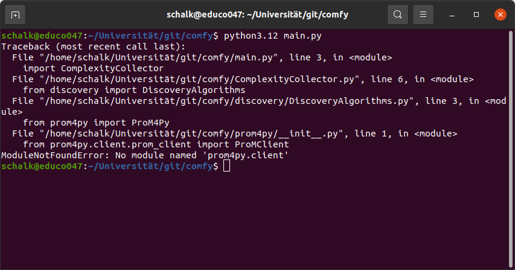

- If you get the following error, you forgot to replace the string `'path-to-prom4py/Prom4Py.sh'` by the path where the `.sh` or `.bat` file are located.
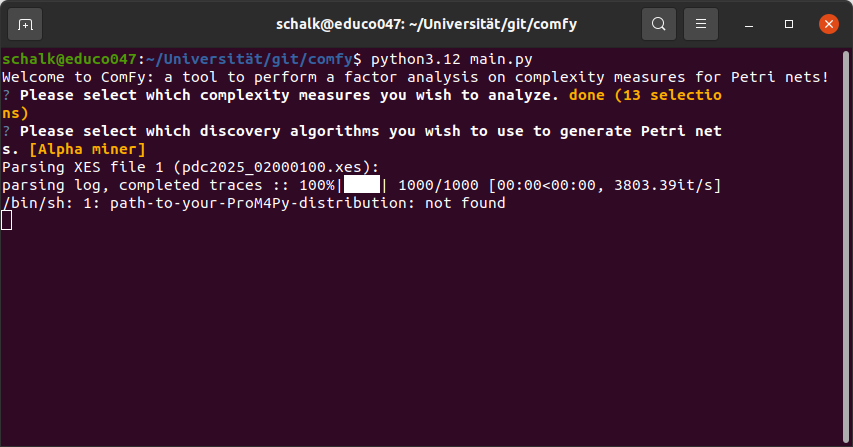


## Usage ##
Ensure that the `xes`-files you want to analyze are in the folder `input-folder`.
For example, you can use the trainings logs from the process discovery contest 2025, found at (https://doi.org/10.4121/7212a73a-1eac-4a08-8c01-973dca020822)
Then, run the program by executing the following command:
```
python3.12 main.py
```
If the installation was successful, you will be greeted by the following sight:
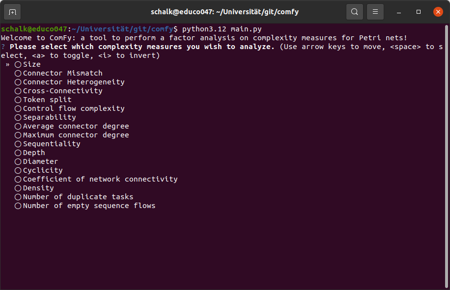
You can use the arrow keys to navigate through the complexity measures and hit the space bar to select the ones you wish to analyze.
Alternatively, you can hit the key 'a' to select all measures and use the space bar to deselect those you do not wish to analyze.
We recommend not choosing the measures cross-connectivity, depth, diameter or cyclicity for your first run, since they take a lot of time to calculate.
As soon as you are happy with your selection, you can hit Enter to go to the next step.
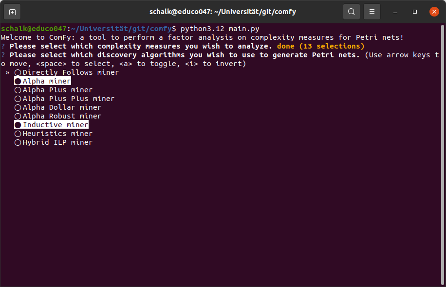
In this selection, you can choose one or more discovery algorithms to automatically discover Petri nets for the event log in the input folder.
ComFy uses the ProM4Py library to perform the discovery, which takes a short moment to initialize.
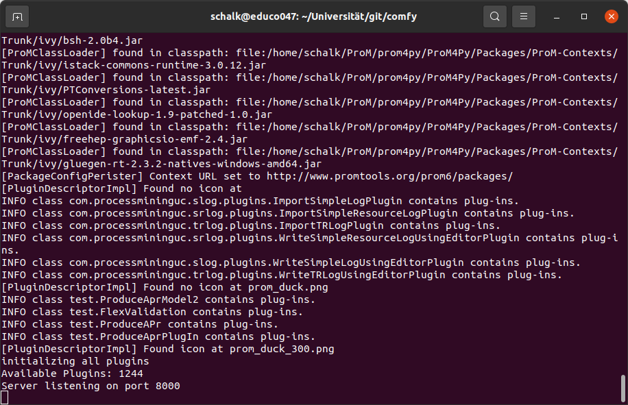
After initialization, ProM4Py is issued to discover the Petri nets.
Depending on the number of `xes`-files in your input folder, this may take a while.
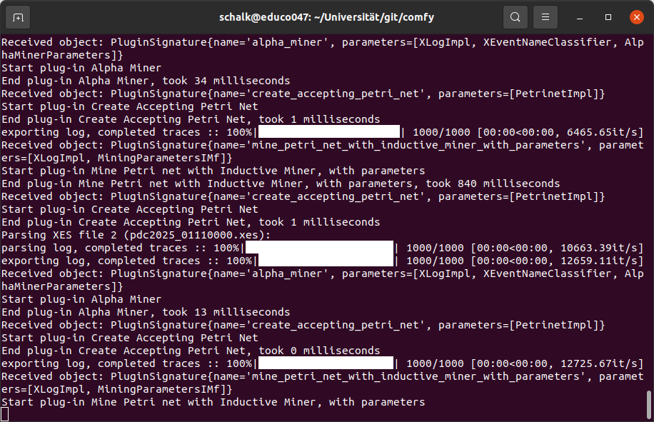
After the discovery phase, ComFy will automatically perform Bartlett's test of sphericity, described at (https://en.wikipedia.org/wiki/Bartlett's_test).
Furthermore, the program will compute all MSA values to perform the Kaiser-Meyer-Olkin test, described at (https://en.wikipedia.org/wiki/Kaiser-Meyer-Olkin_test).
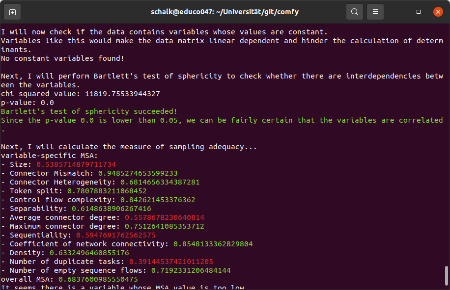
In case Bartlett's test of sphericity fails, the user will be prompted to decide whether to continue the analysis.
If the Kaiser-Meyer-Olkin test fails, because some MSA values are lower than specified by the variable `msa_threshold` in the file `Constants.py`, ComFy removes the variables with insufficient MSA values and recalculates the MSA values for the remaining variables.
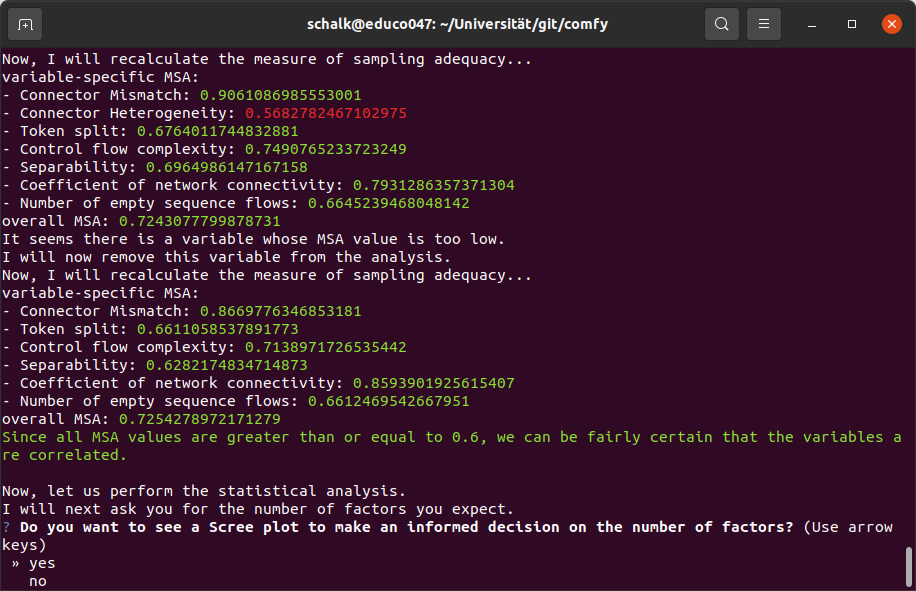
If the MSA test fails because the overall MSA value is too low, the program will exit, since a factor analysis would not be statistically relevant on the provided data.
If the tests succeeded, however, ComFy proposes to show a Scree plot to decide on the number of factors, as described in (https://en.wikipedia.org/wiki/Scree_plot).
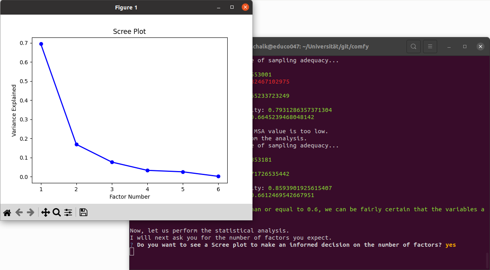
Of course, the user can also decide not to show this plot if they already know the number of factors influencing the complexity scores in their analysis.
After they chose the number of factors, the user can choose the rotation that should be used on the factor loadings during the factor analysis.
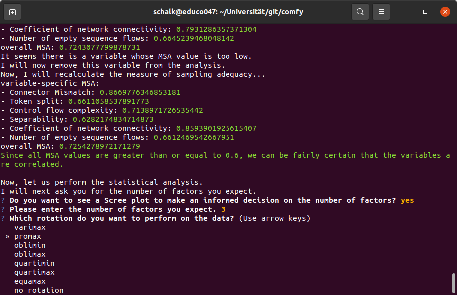
Afterward, ComFy will perform the factor analysis with the specified parameters.
If desired, the program directly shows the factor loadings, descriptive statistics and the communalities by using `matplotlib`.
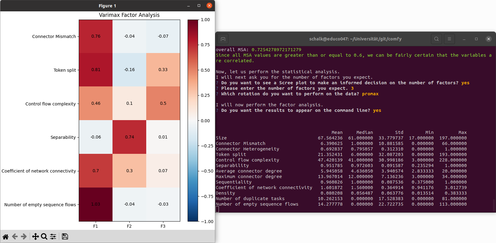
Regardless of the user's choice, ComFy will store the results of the factor analysis and the results of all previous tests in a LaTeX file in the folder `output`.
Furthermore, it stores the raw complexity data in a `csv`-file for later reference or further investigations.
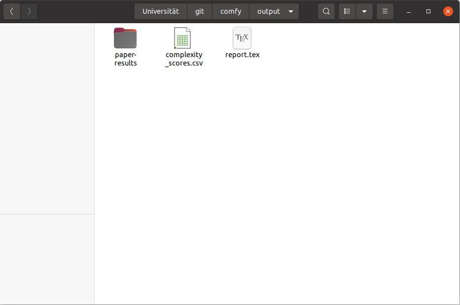
To see the LaTeX files stored during the analysis of the paper *Important Factors: Complexity Dimensions for Petri Nets*, the user may navigate to the folder `paper-results` inside the folder `output`.
On some systems, ProM4Py ends the execution by deleting local files. 
Depending on the sample size and the number of executed discovery algorithms, this might take a while.
However, killing the process during this phase does not pose any problems.
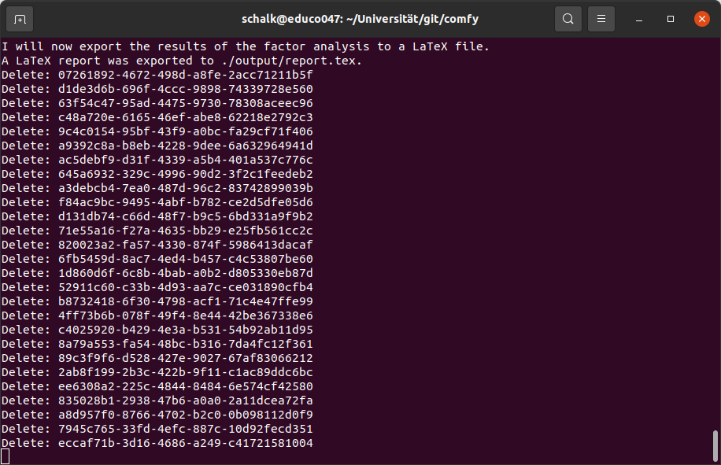


### Selectable Complexity Measures ###
Currently, ComFy allows an analysis of the following complexity measures:
- Size: (https://doi.org/10.1007/978-3-540-89224-3)
- Connector Mismatch: (https://doi.org/10.1007/978-3-540-89224-3)
- Connector Heterogeneity: (https://doi.org/10.1007/978-3-540-89224-3)
- Cross-Connectivity: (https://doi.org/10.1007/978-3-540-69534-9_36)
- Token Split: (https://doi.org/10.1007/978-3-540-89224-3)
- Control Flow Complexity: (https://doi.org/10.1007/978-3-540-89224-3)
- Separability: (https://doi.org/10.1007/978-3-540-89224-3)
- Average Connector Degree: (https://doi.org/10.1007/978-3-540-89224-3)
- Maximum Connector Degree: (https://doi.org/10.1007/978-3-540-89224-3)
- Sequentiality: (https://doi.org/10.1007/978-3-540-89224-3)
- Depth: (https://doi.org/10.1007/978-3-540-89224-3)
- Diameter: (https://doi.org/10.1007/978-3-540-89224-3)
- Cyclicity: (https://doi.org/10.1007/978-3-540-89224-3)
- Coefficient of Network Connectivity: (https://doi.org/10.1007/978-3-540-89224-3)
- Density: (https://doi.org/10.1007/978-3-540-89224-3)
- Number of Duplicate Tasks: (https://doi.org/10.1109/TII.2011.2166795)
- Number of Empty Sequence Flows: (https://doi.org/10.1109/COGINF.2009.5250717)


### Selectable Discovery Techniques ###
Currently, ComFy allows the following options for process discovery:
- Directly Follows Miner -- constructs the directly follows model as detailed in the following paper: (https://doi.org/10.1109/ICPM.2019.00015)
- Alpha miner -- executes the alpha algorithm as detailed in (https://doi.org/10.1109/TKDE.2004.47) and implemented in ProM
- Alpha Plus miner -- executes the alpha plus miner as detailed in (https://doi.org/10.1007/978-3-540-30188-2_12) and implemented in ProM
- Alpha Plus Plus miner -- executes the alpha plus plus miner as detailed in (https://doi.org/10.1007/s10618-007-0065-y) and implemented in ProM
- Alpha Dollar miner -- executes the alpha dollar miner as detailed in (https://doi.org/10.1007/978-3-319-23063-4_7) and implemented in ProM
- Alpha Robust miner -- executes the alpha robust miner as implemented in ProM
- Inductive miner -- executes the inductive miner as detailed in (https://doi.org/10.1007/978-3-319-06257-0_6) and implemented in ProM
- Heuristics miner -- executes the heuristics miner as detailed in (https://research.tue.nl/en/publications/process-mining-with-the-heuristicsminer-algorithm/) and implemented in ProM
- Hybrid ILP miner -- executes the hybrid ILP miner as detailed in (https://doi.org/10.1007/978-3-319-23063-4_10) and implemented in ProM

